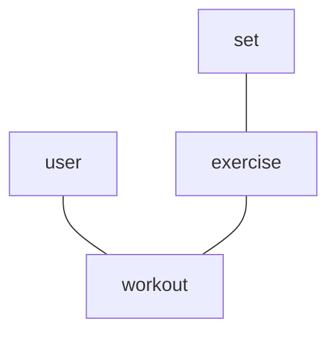
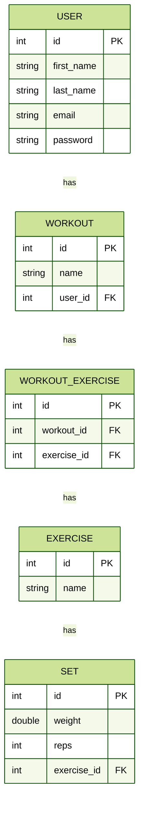

# Gym Log
This is a small web appilication that can be used to track gym progress and for recording workout information such as reps, weight and sets.
This application can be used to create workout with ease for the user to use during a workout quikcly and effectively

# Domain Model

#ERD

